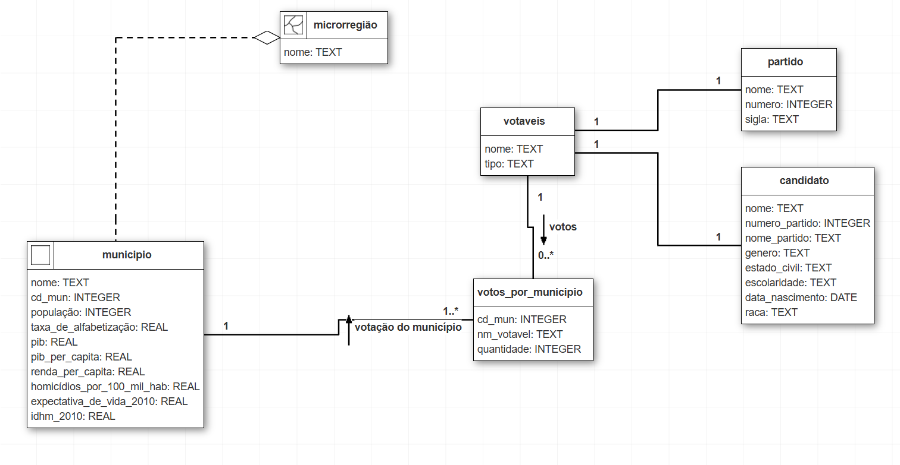

# Trabalho Prático

Com base em arquivos disponibilizados pelo TSE, foi possível obter informações dos candidatos, partidos e da contagem de votos por município no estado do RS em 2022 [RS - Votação por seção eleitoral - 2022
](https://dadosabertos.tse.jus.br/ne/dataset/resultados-2022/resource/12858da8-e607-4b3b-8aa4-9a866c70573c). O notebook ```limpeza_dados.ipynb``` contém a extração, limpeza e formatação destes dados. Assim, foi possível gerar arquivos ```candidatos_2022.csv```, ```votacao_2022.csv``` e ```partidos_2022.csv``` e inseri-los no banco de dados no PostgreSQl.

Além disso, arquivos shapefile do IBGE possibilitaram a criação dos municípios e microrregiões geográficos [Malha Municipal](https://www.ibge.gov.br/geociencias/organizacao-do-territorio/malhas-territoriais/15774-malhas.html?edicao=27413).

Por fim, os dados demográficos dos municípios, contidos em ```municipios_RS_dados_demograficos.csv```, foram obtidos do site [Atlas Brasil](http://www.atlasbrasil.org.br/) e do [Censo de 2010](https://censo2010.ibge.gov.br/).


O script para criar o banco consistiu basicamente na criação de seis tabelas (as restrições de chave estrangeira, dentre outros aspectos, estão omitidas):

```
CREATE TABLE public.rs_municipios_2022 (
    gid integer NOT NULL,
    cd_mun character varying(7),
    nm_mun character varying(50),
    area_km2 double precision,
    geom public.geometry(MultiPolygon),
    populacao integer,
    taxa_de_alfabetizacao real,
    pib real,
    pib_per_capita real,
    renda_per_capita real,
    homicidios_por_100_mil_hab real,
    expectativa_de_vida_2010 real,
    idhm_2010 real
)

CREATE TABLE public.rs_microrregioes_2022 (
    gid integer NOT NULL,
    cd_micro character varying(5),
    nm_micro character varying(100),
    sigla_uf character varying(2),
    area_km2 double precision,
    geom public.geometry(MultiPolygon)
);

CREATE TABLE public.candidatos (
    nome character varying(100) NOT NULL,
    numero_partido integer NOT NULL,
    nome_partido character varying(100) NOT NULL,
    sigla character varying(20) NOT NULL,
    genero character varying(20),
    estado_civil character varying(50),
    escolaridade character varying(100),
    data_nascimento date,
    raca character varying(50)
);


CREATE TABLE public.partidos (
    nome character varying(100) NOT NULL,
    numero integer NOT NULL,
    sigla character varying(20) NOT NULL
);

CREATE TABLE public.votaveis (
    nome character varying(100) NOT NULL,
    tipo character varying(20) NOT NULL
);

CREATE TABLE public.votos (
    cd_mun character varying(7) NOT NULL,
    nome character varying(100) NOT NULL,
    qt_votos integer NOT NULL
);
```



Para a segunda entrega, foram feitos notebooks para gerar as visualizações.

## Autocorrelação espacial de dados de candidatos x municípios/microrregiões

Nos arquivos `correlacao_candidato_municipio.ipynb` e `correlacao_candidato_micro.ipynb` foram feitos Jupyter Notebooks que trazem análises sobre a autocorrelação espacial entre candidatos e municípios/microrregiões. Primeiramente, trazemos um gráfico com o índice de Moran para cada candidato. Então, trazemos gráficos mostrando a distribuição de votos de cada candidato, em duas versões: normalizada pela população do município/microrregião e normalizada pelo total de votos. Por fim, temos gráficos mostrando os clusters espaciais formados pelos votos de cada candidato, sendo duas versões com a segunda normalizada pela população do município/microrregião.

## Correlação Demográfica

O arquivo `correlacao_demografica.ipynb` apresenta o estudo da correlação entre os dados demográficos e as votações obtidas pelos partidos em 2022 para os municípios do RS.

## Autocorrelação espacial de partidos e análise extra

O arquivo `autocorrelacao_espacial_partidos.ipynb` contém a análise de autocorrelação espacial dos partidos e a análise extra. Os votos, municípios e partidos são integrados e tratados para cálculos do Índice de Moran, que identifica clusters espaciais de votação. Foram criados mapas para dois partidos (Republicanos e PSD), destacando padrões de apoio eleitoral, normalizados por total de votos e população municipal. Por fim, a análise extra consiste no cálculo do Índice de Fragmentação de Laakso-Taagepera, que quantifica o número o grau de diversidade partidária. 
